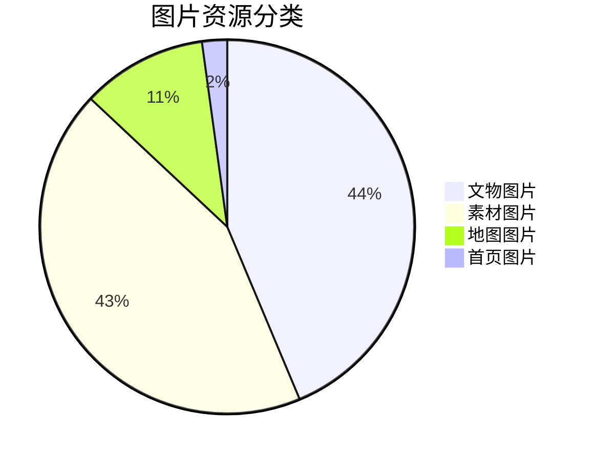

# 🏛️ 天穆地方史网站 - 数据成果展示

## 🎯 项目概览
**天穆地方史数字档案平台**是一个基于现代Web技术构建的地方历史文化展示网站，全面收录了天穆村的历史文物、地图资料、口述历史等珍贵资料。

## 📊 核心数据统计

### 🏆 总体成果
| 类别 | 数量 | 亮点 |
|------|------|------|
| **图片资源** | 277张 | 高清历史图片 |
| **文物展品** | 87件 | 详实历史资料 |
| **展览主题** | 4个 | 系统化展示 |
| **展览单元** | 14个 | 精细化分类 |
| **音频资料** | 4个 | 口述历史 |
| **数据总量** | **386项** | 丰富的内容资源 |

### 🖼️ 图片资源分布

### 🏺 文物数据特点
- **编号系统**: a-0001 至 a-0087
- **完整信息**: 每件文物包含标题、描述、来源、图片
- **主题分类**: 按历史时期和内容主题系统分类
- **学术价值**: 基于实地调研和历史文献

## 🏗️ 技术架构

### 🛠️ 技术栈
- **前端框架**: React 19 + TypeScript
- **构建工具**: Vite
- **样式系统**: Tailwind CSS
- **路由管理**: React Router
- **地图组件**: Leaflet + React Leaflet
- **动画效果**: Framer Motion

### 🚀 部署方案
- **主平台**: Vercel（自动部署、全球CDN）
- **备选平台**: GitHub Pages
- **自定义域名**: 支持绑定
- **SSL证书**: 自动配置

## 📱 功能特性

### 🎨 用户体验
- **响应式设计**: 适配手机、平板、电脑
- **流畅动画**: 页面过渡和交互动画
- **图片懒加载**: 优化页面性能
- **搜索功能**: 快速查找文物
- **主题切换**: 统一的视觉风格

### 🗺️ 特色功能
1. **交互式地图** - 历史地图与现代地图叠加
2. **时间轴浏览** - 按年代顺序查看文物
3. **主题展览** - 系统化的内容组织
4. **收藏功能** - 用户可收藏感兴趣的内容
5. **分享功能** - 一键分享到社交媒体

## 📈 数据可视化展示

### 🕰️ 时间分布
- **最早文物**: 明万历三十六年（1609）
- **时间跨度**: 400余年历史
- **时期覆盖**: 明清、民国、新中国成立、改革开放

### 🗺️ 空间分布
- **地理范围**: 天穆村及周边区域
- **地图类型**: 历史地图、现代地图、专题地图
- **空间分析**: 村落变迁、建筑分布、交通网络

## 🎯 应用价值

### 🏫 教育应用
- **教学资源**: 适合历史、地理教学
- **研究资料**: 为学术研究提供基础数据
- **公众教育**: 普及地方历史文化知识

### 🏛️ 文化传承
- **数字存档**: 珍贵历史资料的数字化保存
- **文化传播**: 让更多人了解天穆历史文化
- **社区认同**: 增强社区居民的文化认同感

## 🔮 未来发展

### 📊 数据扩展
- **目标**: 文物数量达到150件
- **新增**: 视频资料、3D模型
- **完善**: 口述历史访谈

### 🚀 功能升级
- **多语言支持**: 中英文切换
- **虚拟展览**: 3D虚拟展厅
- **互动体验**: AR/VR技术应用
- **数据分析**: 数据可视化分析工具

### 🌐 平台扩展
- **移动应用**: 开发手机App
- **API开放**: 提供数据接口
- **合作平台**: 与博物馆、图书馆系统对接

## 👥 项目团队

### 🛠️ 技术开发
- **前端开发**: React技术栈专家
- **UI设计**: 专业设计师团队
- **项目管理**: 敏捷开发流程

### 📚 内容策划
- **历史顾问**: 地方史研究专家
- **内容编辑**: 专业编辑团队
- **质量控制**: 数据审核机制

## 📞 联系方式

### 💼 项目合作
- **技术支持**: 网站开发与维护
- **内容合作**: 资料提供与整理
- **学术合作**: 研究项目合作

### 🆘 技术支持
- **问题反馈**: GitHub Issues
- **文档查看**: 项目README
- **在线演示**: Vercel部署版本

---

## 🏆 项目亮点总结

### ✅ 已完成
- [x] 87件文物数字化整理
- [x] 277张高清图片处理
- [x] 4个主题展览策划
- [x] 响应式网站开发
- [x] Vercel平台部署

### 🎯 核心优势
1. **数据丰富** - 386项高质量内容资源
2. **技术先进** - 现代Web技术栈
3. **用户体验** - 流畅的交互体验
4. **扩展性强** - 模块化架构设计
5. **维护方便** - 自动化部署流程

### 🌟 社会价值
- **文化传承**: 保护地方历史文化
- **教育价值**: 提供优质教学资源
- **研究价值**: 为学术研究提供数据支持
- **社区价值**: 增强社区文化认同

---

**展示文件生成时间**: 2026年6月2日  
**数据统计基准**: 项目最新版本  
**适用场景**: 项目展示、合作洽谈、成果汇报